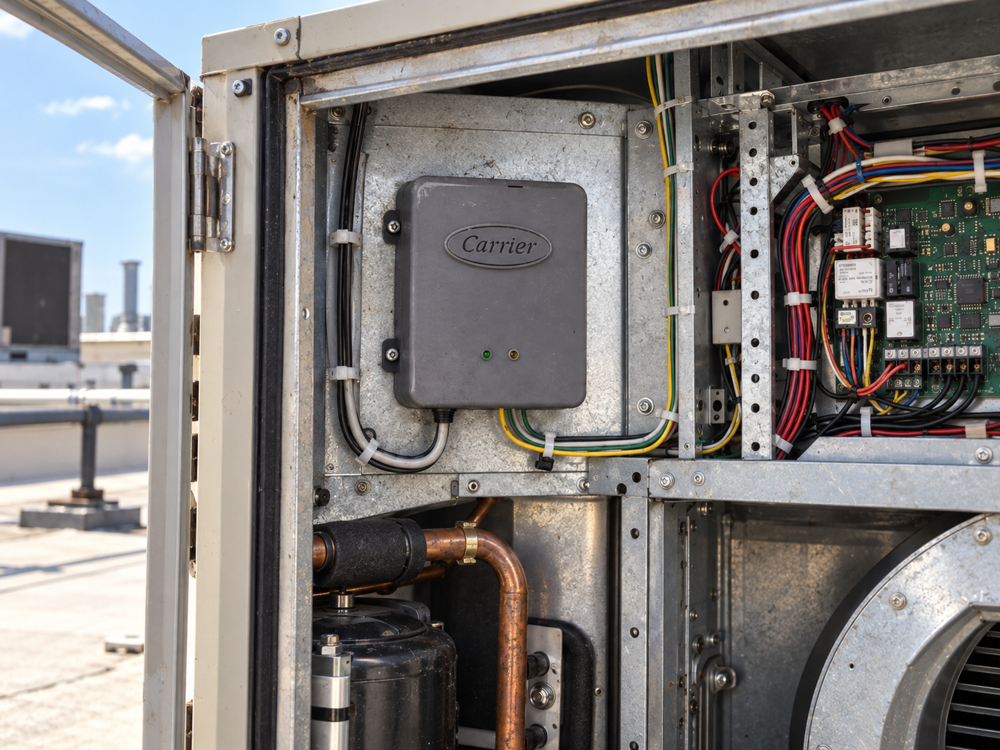
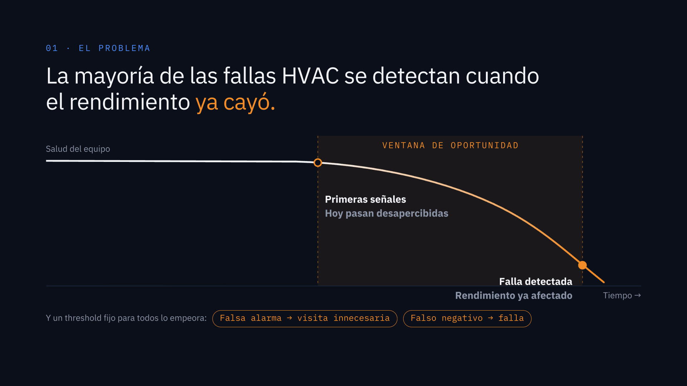
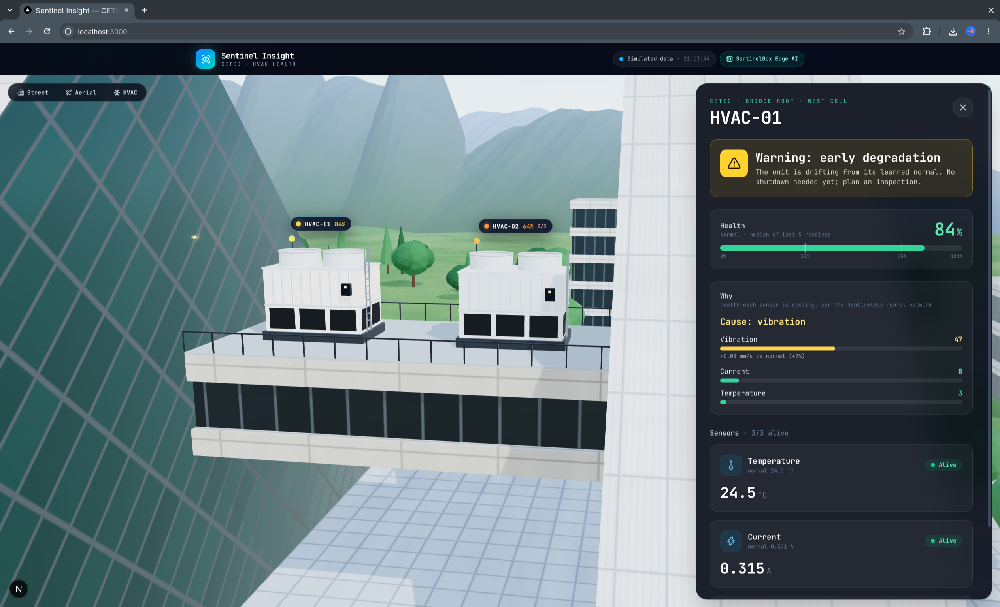
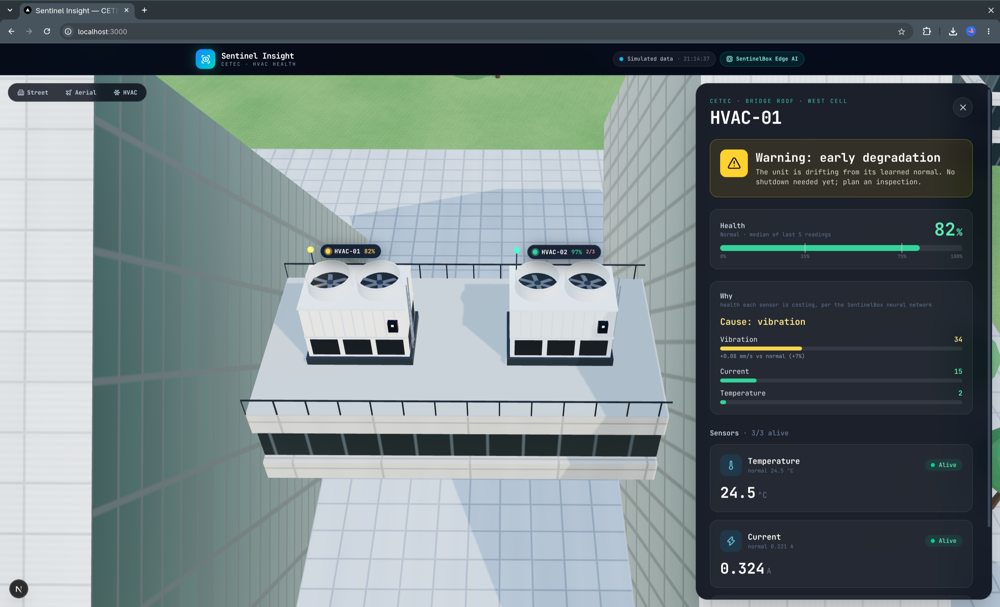
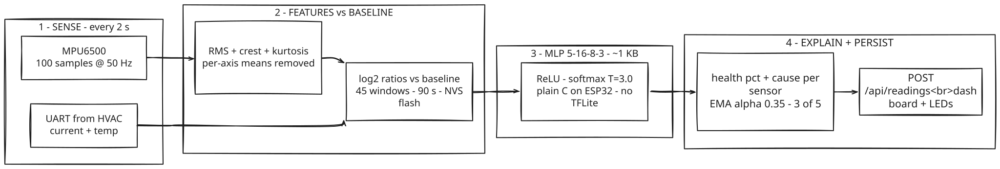
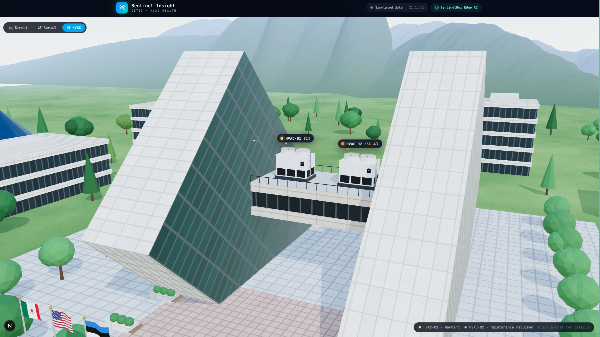

# SentinelBox

**Predictive maintenance at the edge for HVAC systems — 🥇 1st place, Keep It Cool Hackathon (Carrier, 2026).**

Every HVAC already measures current and temperature to *operate*. Nobody uses that data to *prevent* failures. SentinelBox taps into the signals every HVAC already has, complements them with new sensors integrated in the box (vibration), and learns each unit's normal behavior — so maintenance happens before performance drops, not after.



## The problem

Most HVAC failures are detected when performance has already degraded. There is a window of opportunity — the first early signals — that goes unnoticed today. And a single fixed threshold for every unit makes it worse: false alarms trigger unnecessary visits, missed detections end in breakdowns.



## The solution

SentinelBox learns each unit's normal instead of applying one threshold to all of them. Two demo fans intentionally run different normal current profiles; the system still recognizes each one's normal independently.



- **Edge processing on ESP32, no cloud required.** The decision runs on the gateway.
- **One baseline per unit** (current, temperature, vibration), learned in ~90 s.
- **Two states:** ● NORMAL ● MAINTENANCE REQUIRED (+ WARNING while degrading, LEARNING while baselining).

## Edge AI: a neural network running on the ESP32

The gateway doesn't apply fixed thresholds — it runs a neural network, on-device, every 2 seconds. No cloud, no round-trips, no connectivity required.

**1. Sense.** Each 2 s window: 100 vibration samples @ 50 Hz from the MPU6500 (±4g, per-axis means removed) → RMS, crest factor, kurtosis. Mean current (INA219) and temperature (MAX6675) arrive from the HVAC node over UART.

**2. Compare against a learned baseline, not programmed constants.** The first 45 windows (~90 s) of normal operation become *that unit's* baseline, persisted in NVS flash so it survives reboots (`r` over serial relearns it). Every network input is expressed *relative* to baseline — so one trained network works across fan sizes, speeds, and mountings:

| # | Network input | Formula |
|---|---|---|
| 1 | `vib_rms` | log₂(RMS / baseline) |
| 2 | `vib_crest` | log₂(crest / baseline), faded out near the noise floor |
| 3 | `vib_kurt` | log₂(kurtosis / baseline), faded out near the noise floor |
| 4 | `current` | log₂(I / baseline) |
| 5 | `temp` | (T − baseline) / 5 °C |

**3. Infer on-chip.** MLP **5→16→8→3** (ReLU, softmax T=3.0): **259 float32 parameters ≈ 1 KB**, written in plain C (`SentinelBox/sentinel_ann.h`, weights in generated `SentinelBox/sentinel_model.h`). No TensorFlow Lite, no heap allocator — deterministic inference in microseconds on the ESP32. Outputs NORMAL / WARNING / MAINTENANCE, converted to health % rescaled so the unit's own baseline reads exactly 100.

**4. Explain + persist.** An attribution pass re-runs the net with the other sensors held at baseline, so the dashboard can say *why* ("Cause: vibration, +0.18 mm/s vs normal (+16%)"). Health is EMA-smoothed (α=0.35) and the status flips only when the abnormal class persists **3 of the last 5 readings** — one isolated peak changes nothing.





**Measured model performance** (`ml/artifacts/metrics.json`, held-out test set):

| | Detection rate | False alarm rate | Missed anomaly rate |
|---|---|---|---|
| Neural network | **1.000** | 0.003 | **0.000** |
| Weighted-score rule (baseline) | 0.965 | 0.0003 | 0.035 |

Overall test accuracy **0.9936**; C/Python inference parity verified with gcc (max probability diff ~1e-6). Retrainable on your own recordings — see [`docs/setup.md`](docs/setup.md) and `ml/README.md`.

**Why edge instead of cloud:** works with zero connectivity (the demo runs on a phone hotspot with no data plan); milliseconds from sense to decision; no bandwidth or cloud bills per unit; raw vibration never leaves the site; behavior is deterministic and testable on the bench.

## Validation results

Measured on the prototype (normal operation vs. controlled perturbations: hair dryer for temperature, airflow/rotor interference for current and vibration):

| Metric | Result |
|---|---|
| Average detection time | **6 s** |
| Baseline learning time | **90 s** |
| False alarm rate | **0 %** |
| Detection performance — current / temperature / vibration | **6 / 3 / 57** |



## System architecture

```
┌──────────┐  UART JSON   ┌─────────────┐  WiFi (iPhone hotspot)   ┌──────────────┐
│ HVAC-01  │ ────────────▶│             │ ────────────────────────▶│              │
│ INA219 + │  temp+curr   │ SentinelBox │  POST /api/readings      │  Next.js app │
│ MAX6675  │              │ ESP32+MPU   │  (+ vibration measured   │  SQLite +    │
├──────────┤  (plug &     │ gateway     │   on the gateway)        │  3D dashboard│
│ HVAC-02  │   play, one  │             │                          │              │
│ INA219 + │   at a time) │             │                          │              │
│ MAX6675  │              │             │                          │              │
└──────────┘              └─────────────┘                          └──────────────┘
```

- **HVAC nodes** (`HVAC01/`, `HVAC02/`) — sensor boards on each fan. They only send what they measure (`unit_id`, `temperature`, `current`) plus a `HELLO` with their ID on boot. No WiFi, no decisions.
- **SentinelBox gateway** (`SentinelBox/`) — one UART port, WiFi, and its own vibration sensor. It completes the 6-field reading, runs the neural network, and POSTs to the server. Swap HVACs live and it detects the new unit by itself (retrofit plug-and-play demo).
- **Web app** (`src/`) — Next.js dashboard: 3D building twin with clickable units, live charts, alert cause breakdown, and a REST API with SQLite storage. Works fully offline on a local network.

## Business model

A service inside the policy the customer already pays. Installed by Carrier technicians during an already-scheduled visit — no extra trip.

| | |
|---|---|
| Upfront (device + install, once) | **$3,000 MXN** |
| Monthly (dashboard, alerts, support) | **$150 MXN** |
| Sold to | Stores with rooftops, Carrier BluEdge policy customers in Mexico |
| Margin for Carrier | **$1,267** per install / **$121** monthly per unit |

Projected 5-year return: **3.9x ROI · 38% IRR · $2.76M NPV**. Next step: finished product and pilot with Carrier policy customers.

## Try the demo (60 seconds, no hardware)

```bash
npm install
npm run dev          # dashboard at http://localhost:3000
npm run sim:seed     # backfill 25 min of both units
npm run sim:start    # stream live readings every 2 s
```

Open the dashboard: HVAC-02 degrades live while HVAC-01 stays healthy — each against its own baseline.

## Full technical setup

All engineering docs live in `docs/`:

- [`docs/setup.md`](docs/setup.md) — hardware, pin tables, firmware flashing, network, dashboard
- [`docs/api.md`](docs/api.md) — REST API reference with curl examples
- [`docs/demo-checklist.md`](docs/demo-checklist.md) — field day-of-demo checklist (hotspot, IPs, flash order, debugging)

## Repository layout

| Path | What |
|---|---|
| `SentinelBox/` | Gateway firmware (ESP32 + MPU6500 + embedded ANN) |
| `HVAC01/` | HVAC-01 node firmware (ESP32-C3, PWM fan, INA219 + MAX6675, UART) |
| `HVAC02/` | HVAC-02 node firmware (ESP32, fixed fan, INA219 + MAX6675, UART) |
| `src/` | Next.js dashboard + REST API (`src/app/api/*`) |
| `src/lib/sentinel/` | Shared validation, SQLite store, simulator, API client |
| `ml/` | Neural-network training pipeline (retrainable, exports to ESP32) |
| `data/` | Local SQLite database (git-ignored, auto-created) |
| `docs/` | Technical setup, API reference, demo checklist |

## Team

Eduardo Pérez · Pedro Uribe · Alejandro Chio · Emiliano Méndez · Miguelangelngel Rodríguez — 🥇 1st place, Keep It Cool Hackathon (Carrier, 2026).

Repository: https://github.com/ayexxxd/SentinelBox
